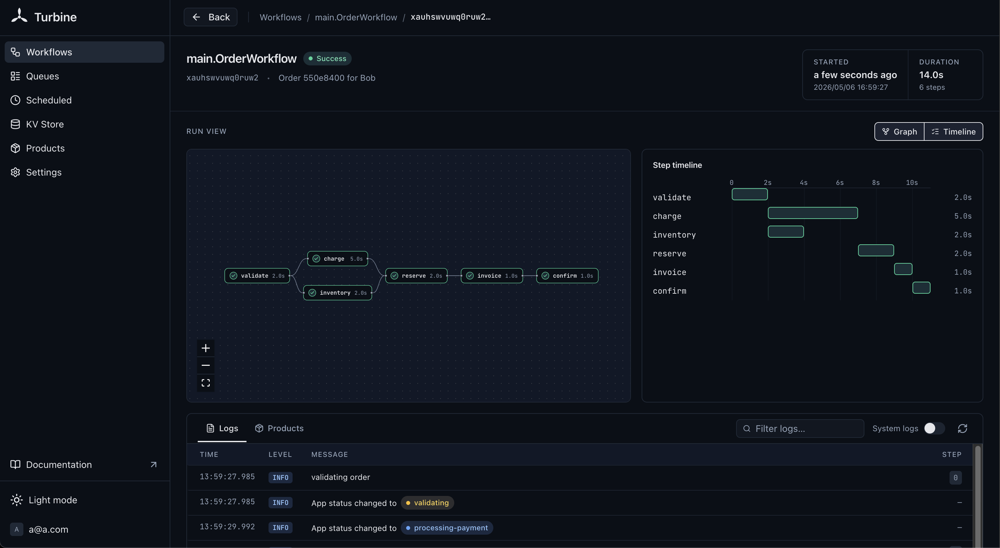

# turbine



Durable workflow engine for [PocketBase](https://pocketbase.io). Runs entirely on SQLite — no external dependencies.

## Features

- **Durable workflows** — survive crashes, restart where they left off
- **Steps** — record intermediate results, replay on recovery
- **Step retries** — automatic retries with exponential backoff
- **Queues** — concurrency control, priority, rate limiting, partitioning
- **Scheduled workflows** — cron expressions via PocketBase's built-in scheduler
- **Send/Receive** — inter-workflow messaging
- **Events** — key-value signaling between workflows
- **Durable pause** — survives restarts
- **Timeout/Deadline** — cancel workflows after a duration or at a specific time
- **Garbage collection** — automatic cleanup of completed workflows

## Install

```bash
go get github.com/YakirOren/turbine
```

## Quick Start

```go
package main

import (
	"log"

	"github.com/YakirOren/turbine"
	"github.com/pocketbase/pocketbase"
	"github.com/pocketbase/pocketbase/core"
)

func main() {
	app := pocketbase.New()

	rt := turbine.Setup(app, turbine.Config{})

	greet := func(ctx turbine.Context, name string) (string, error) {
		return "hello " + name, nil
	}

	turbine.Register(rt, greet)

	// Call workflows from PocketBase routes
	app.OnServe().BindFunc(func(e *core.ServeEvent) error {
		e.Router.POST("/greet/{name}", func(re *core.RequestEvent) error {
			name := re.Request.PathValue("name")

			handle, err := turbine.Run(rt, greet, name)
			if err != nil {
				return re.JSON(500, map[string]string{"error": err.Error()})
			}

			result, err := handle.GetResult()
			if err != nil {
				return re.JSON(500, map[string]string{"error": err.Error()})
			}

			return re.JSON(200, map[string]string{"result": result})
		})
		return e.Next()
	})

	if err := app.Start(); err != nil {
		log.Fatal(err)
	}
}
```

## Workflows

A workflow is a function with the signature `func(ctx turbine.Context, input P) (R, error)`.

```go
myWorkflow := func(ctx turbine.Context, input string) (string, error) {
    // This step's result is recorded — on recovery it replays from the DB
    doubled, err := turbine.Do(ctx, func(ctx context.Context) (string, error) {
        return input + input, nil
    }, turbine.WithStepName("double"))
    if err != nil {
        return "", err
    }
    return doubled, nil
}

turbine.Register(rt, myWorkflow)
```

Run a workflow:

```go
handle, err := turbine.Run(rt, myWorkflow, "hello")
if err != nil {
    log.Fatal(err)
}

result, err := handle.GetResult()
// result == "hellohello"
```

### Registration Options

```go
turbine.Register(rt, myWorkflow,
    turbine.WithName("my-workflow"),       // custom name (default: function name)
    turbine.WithMaxRetries(50),            // max recovery attempts (default: 100)
)
```

### Workflow Options

```go
turbine.Run(rt, myWorkflow, input,
    turbine.WithID("custom-id"),                      // deterministic ID
    turbine.WithQueue("my-queue"),                     // enqueue instead of run immediately
    turbine.WithDeduplicationID("dedup-key"),          // prevent duplicate enqueues
    turbine.WithPriority(1),                           // lower = higher priority
    turbine.WithQueuePartitionKey("tenant-1"),         // partition key for partitioned queues
    turbine.WithTimeout(30*time.Second),               // cancel after 30s
    turbine.WithDeadline(time.Now().Add(time.Hour)),   // cancel at specific time
)
```

### Timeout / Deadline

Set a timeout or absolute deadline on a workflow. The workflow's context is cancelled when the time expires. Both values are persisted — on recovery, the original deadline is restored.

```go
// Timeout: relative duration from when the workflow starts executing
handle, _ := turbine.Run(rt, myWorkflow, input,
    turbine.WithTimeout(5*time.Minute),
)

// Deadline: absolute point in time
handle, _ := turbine.Run(rt, myWorkflow, input,
    turbine.WithDeadline(time.Date(2025, 12, 31, 23, 59, 59, 0, time.UTC)),
)
```

If both are set, the deadline takes precedence.

## Steps

Steps are the unit of durable execution. Each step's result is recorded in SQLite. On recovery, recorded steps replay their saved result instead of re-executing.

```go
result, err := turbine.Do(ctx, func(ctx context.Context) (int, error) {
    return callExternalAPI()  // only called once, even across crashes
}, turbine.WithStepName("call-api"))
```

### Step Retries

Steps support automatic retries with exponential backoff:

```go
result, err := turbine.Do(ctx, callUnreliableAPI,
    turbine.WithStepName("fetch"),
    turbine.WithStepMaxRetries(5),                    // retry up to 5 times
    turbine.WithBackoffFactor(2.0),                   // exponential backoff multiplier
    turbine.WithBaseInterval(500*time.Millisecond),   // initial delay between retries
    turbine.WithMaxInterval(10*time.Second),          // cap on retry delay
)
```

### Concurrent Steps

Run steps in parallel with `DoAsync`:

```go
ch, _ := turbine.DoAsync(ctx, func(ctx context.Context) (int, error) {
    return expensiveComputation()
}, turbine.WithStepName("compute"))

outcome := <-ch
// outcome.Result, outcome.Err
```

## Pause

Durable pause that survives crashes and restarts. The wake-up time is recorded as a step — on recovery, if the time has passed, it returns immediately; otherwise it pauses only the remaining duration.

```go
if err := turbine.Pause(ctx, 24*time.Hour); err != nil {
    return "", err
}
```

## Queues

```go
q := rt.Queue("emails",
    turbine.WithWorkerConcurrency(5),
    turbine.WithGlobalConcurrency(10),
    turbine.WithRateLimiter(turbine.RateLimiter{Limit: 100, Period: time.Minute}),
    turbine.WithPriorityEnabled(),
    turbine.WithPartitionQueue(),                      // enable partitioned processing
)

// Enqueue a workflow
turbine.Run(rt, sendEmail, recipient, turbine.WithQueue("emails"))
```

In a multi-instance setup, use `Listen` to control which queues each instance processes:

```go
rt.Listen(q)
```

## Scheduled Workflows

Uses PocketBase's built-in cron. Scheduled workflows must accept `time.Time` as input.

```go
cleanup := func(ctx turbine.Context, scheduledAt time.Time) (string, error) {
    // runs every hour
    return "cleaned", nil
}

turbine.Register(rt, cleanup, turbine.WithSchedule("0 * * * *"))
```

## Communication

### Send / Receive

```go
// In workflow A: send a message
turbine.Send(ctx, targetWorkflowID, "payload", "my-topic")

// In workflow B: receive (blocks until message arrives or timeout)
msg, err := turbine.Receive[string](ctx, "my-topic", 30*time.Second)
```

### Events

```go
// In workflow A: set a key-value event
turbine.SetValue(ctx, "status", "ready")

// Anywhere: get the event (blocks until set or timeout)
val, err := turbine.GetValue[string](ctx, workflowID, "status", 10*time.Second)
```

## Management

```go
// Get the current workflow ID from within a workflow
wfID := ctx.WorkflowID()

// Retrieve a handle to an existing workflow
handle := turbine.Retrieve[string](rt, "workflow-id")
result, err := handle.GetResult()
status, err := handle.GetStatus()

// Cancel / Resume
rt.Cancel("workflow-id")
rt.Resume("workflow-id")

// Inspect steps
steps, err := rt.Steps("workflow-id")
```

## Garbage Collection

Completed workflows (SUCCESS/ERROR) are automatically cleaned up on a schedule. By default, workflows older than 72 hours are deleted daily at midnight.

```go
rt := turbine.Setup(app, turbine.Config{
    GCRetention: 24 * time.Hour,     // keep completed workflows for 24h (default: 72h)
    GCSchedule:  "0 */6 * * *",      // run GC every 6 hours (default: "0 0 * * *")
})
```

Set `GCRetention` to a negative value to disable automatic garbage collection entirely.

You can also trigger GC manually:

```go
err := rt.GarbageCollect()
```

Pending and enqueued workflows are never deleted by GC.

## How It Works

turbine stores all workflow state in SQLite collections managed by PocketBase. Collections are created automatically on first launch — no migrations needed.

| Collection | Purpose |
|---|---|
| `pt_workflow_status` | Workflow metadata, status, queue assignment, and lifecycle tracking |
| `pt_operation_outputs` | Step results — replayed on recovery instead of re-executing |
| `pt_notifications` | Inter-workflow messages (Send/Receive) |
| `pt_workflow_events` | Key-value events (current state) |
| `pt_workflow_events_history` | Event history for step-level replay |

The queue runner polls SQLite for enqueued workflows using atomic `UPDATE ... RETURNING` to prevent double-dispatch. An in-process event bus provides low-latency wake-ups.

## Examples

See the [`examples/`](examples/) directory for complete working examples:

- [`basic`](examples/basic/) — minimal workflow
- [`steps`](examples/steps/) — multi-step order processing
- [`concurrent`](examples/concurrent/) — parallel steps with `DoAsync`
- [`retry`](examples/retry/) — step retries with exponential backoff
- [`sleep`](examples/sleep/) — durable pause
- [`queue`](examples/queue/) — queue with concurrency and rate limiting
- [`scheduled`](examples/scheduled/) — cron-scheduled workflows
- [`events`](examples/events/) — key-value events
- [`lifecycle`](examples/lifecycle/) — cancel, resume, and inspect workflows
