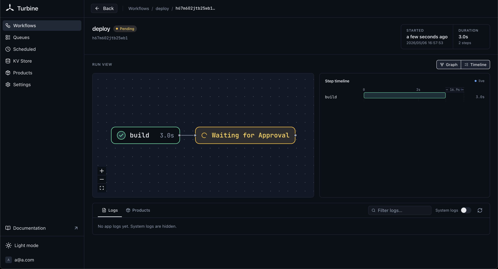
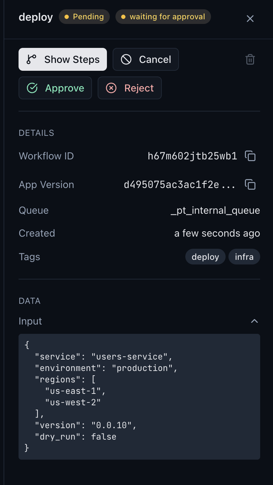

# Approvals



You can pause a workflow and wait for a human decision. The gate is durable, it survives crashes and restarts.

## Waiting for Approval

```go
func DeployWorkflow(ctx turbine.Context, input DeployInput) (string, error) {
    // ... build steps ...

    result, err := turbine.WaitForApproval(ctx)
    if err != nil {
        return "", err
    }

    if !result.Approved {
        return "rejected: " + result.Comment, nil
    }

    // ... deploy steps ...
}
```

The workflow's [app status](/concepts/app-status) is automatically set to "waiting for approval" (yellow) while blocked.

## ApprovalResult

```go
type ApprovalResult struct {
    Approved bool   `json:"approved"`
    Comment  string `json:"comment,omitempty"`
}
```

## Setting a Timeout

By default, `WaitForApproval` blocks indefinitely. Use `WithApprovalTimeout` to set a deadline:

```go
result, err := turbine.WaitForApproval(ctx,
    turbine.WithApprovalTimeout(1 * time.Hour),
)
if errors.Is(err, turbine.ErrApprovalTimeout) {
    // no decision within 1 hour
}
```

## Delivering a Decision

### From an HTTP Handler

Send an `ApprovalResult` via the approval topic:

```go
err := turbine.Send(
    rt.NewContext(re.Request.Context()),
    workflowID,
    &turbine.ApprovalResult{Approved: true, Comment: "LGTM"},
    "pt.approval",
)
```

### From Another Workflow

```go
turbine.Send(ctx, targetWorkflowID,
    &turbine.ApprovalResult{Approved: false, Comment: "insufficient budget"},
    "pt.approval",
)
```

### From the Dashboard

The Turbine dashboard shows an approve/reject UI for workflows that are waiting for approval.



See the [dashboard example](/examples/dashboard) for a deploy workflow with an approval gate (`DeployWorkflow`).
