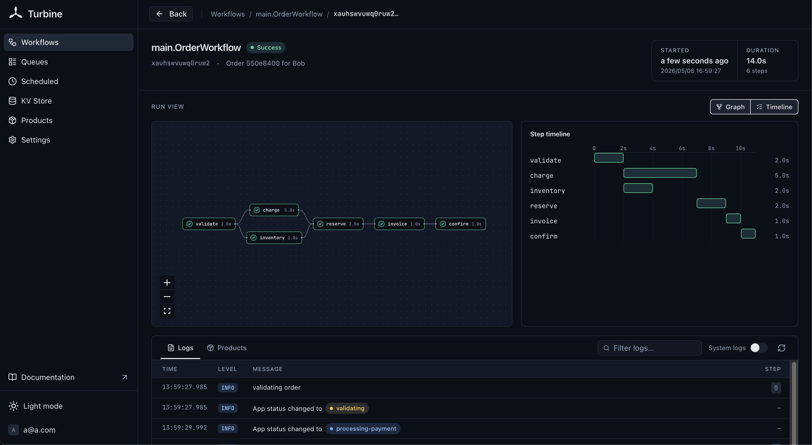

# Steps

Steps are the unit of durable execution. Each step's result is recorded in SQLite. On recovery, recorded steps replay their saved result instead of re-executing.



```go
result, err := turbine.Do(ctx, func(ctx context.Context) (int, error) {
    return callExternalAPI()  // only called once, even across crashes
}, turbine.WithStepName("call-api"))
```

::: tip
Steps receive `context.Context` (not `turbine.Context`). This prevents calling `Do` or `Sleep` inside a step at compile time.
:::

## Step Retries

Steps support automatic retries with exponential backoff:

```go
result, err := turbine.Do(ctx, callUnreliableAPI,
    turbine.WithStepName("fetch"),
    turbine.WithStepMaxRetries(5),                    // retry up to 5 times
    turbine.WithBackoffFactor(2.0),                   // exponential backoff multiplier (default: 2.0)
    turbine.WithBaseInterval(500*time.Millisecond),   // initial delay between retries (default: 100ms)
    turbine.WithMaxInterval(10*time.Second),          // cap on retry delay (default: 5s)
)
```

::: warning
When a step exceeds its max retries, the workflow fails with `ErrMaxRetries`. The original error is wrapped and accessible via `errors.Unwrap`. See [Error Handling](/concepts/errors).
:::

## Concurrent Steps

Run steps in parallel with `DoAsync`. Returns a channel of `AsyncResult[R]`:

```go
ch, _ := turbine.DoAsync(ctx, func(ctx context.Context) (int, error) {
    return expensiveComputation()
}, turbine.WithStepName("compute"))

result := <-ch
// result.Result, result.Err
```

## Sleep

Durable sleep that survives crashes and restarts. The wake-up time is recorded as a step, on recovery, if the time has passed, it returns immediately; otherwise it sleeps only the remaining duration.

```go
if err := turbine.Sleep(ctx, 24*time.Hour); err != nil {
    return "", err
}
```

To wake at a wall-clock time instead of after a delay, use `turbine.SleepUntil`. The first target is recorded, so recovery wakes at the same time:

```go
now := time.Now()
tomorrow9am := time.Date(now.Year(), now.Month(), now.Day()+1, 9, 0, 0, 0, time.Local)
if err := turbine.SleepUntil(ctx, tomorrow9am); err != nil {
    return "", err
}
```

`turbine.Pause` is an alias for `turbine.Sleep`.

On shutdown, a sleeping workflow stops waiting at once and stays `PENDING`. The next launch resumes it with only the remaining time, and the interrupted run doesn't count toward its recovery attempts.

To suspend until something happens rather than for a fixed time, use [`turbine.Recv`](/concepts/communication#waiting-for-an-event).

## Accessing Context

Use helper functions to access the logger and app from within steps:

```go
result, err := turbine.Do(ctx, func(ctx context.Context) (string, error) {
    logger := turbine.LoggerFrom(ctx)
    app := turbine.AppFrom(ctx)

    logger.Info("doing work")
    return "done", nil
}, turbine.WithStepName("work"))
```

## Skipping Checkpoints

By default, every step result is saved to SQLite for replay on recovery. For steps that produce non-serializable results (like network connections), use `WithoutCheckpoint()` to always re-execute. See [Checkpoints](/concepts/checkpoints) for details.

## Dashboard

The workflow detail view renders a visual DAG of your steps, showing execution order, duration per step, and current status. Tabs below the graph let you switch between **Logs** and **Products**.
