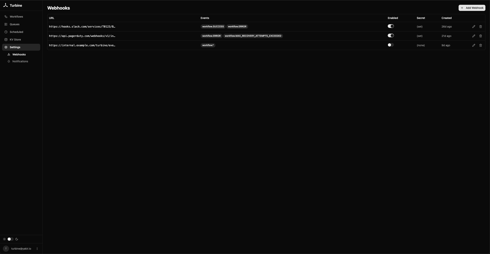

# Webhooks

Turbine sends HTTP POST requests when workflows complete. Configured via the `pt_webhooks` collection — manageable from the dashboard or the PocketBase API.

For human-readable notifications to Slack, Discord, email, etc., see [Notifications](./notifications.md).

## Creating a Webhook

Create a record in `pt_webhooks` with:

| Field | Type | Description |
|---|---|---|
| `url` | `string` | The endpoint to POST to (required) |
| `events` | `json` | Array of event names to subscribe to (required) |
| `enabled` | `bool` | Whether the webhook is active |
| `secret` | `string` | HMAC secret for signature verification (optional) |

## Events

| Event | Fires when |
|---|---|
| `workflow.SUCCESS` | Workflow completed successfully |
| `workflow.ERROR` | Workflow failed with an error |
| `workflow.CANCELLED` | Workflow was cancelled |
| `workflow.WAITING_FOR_APPROVAL` | Workflow is paused at an approval gate |
| `workflow.MAX_RECOVERY_ATTEMPTS_EXCEEDED` | Workflow exceeded max recovery attempts (dead letter) |
| `workflow.*` | Any of the above events |

Example events array: `["workflow.SUCCESS", "workflow.ERROR"]`

## Payload

```json
{
  "event": "workflow.SUCCESS",
  "workflow_id": "abc123",
  "name": "OrderWorkflow",
  "status": "SUCCESS",
  "output": {"order_id": "order-456", "tracking": "TRACK-789"},
  "timestamp": "2026-03-27T12:00:00Z"
}
```

| Field | Description |
|---|---|
| `event` | The event name (e.g., `workflow.SUCCESS`) |
| `workflow_id` | The workflow ID |
| `name` | The workflow function name |
| `status` | The final status |
| `output` | The workflow result (JSON-parsed if possible) |
| `error` | Error message (only for `ERROR` status) |
| `timestamp` | ISO 8601 timestamp |

## Signature Verification

If a `secret` is set, Turbine signs the payload with HMAC-SHA256 and sends it in the `X-Turbine-Signature` header.

```go
func verifySignature(body []byte, secret, signature string) bool {
    mac := hmac.New(sha256.New, []byte(secret))
    mac.Write(body)
    expected := hex.EncodeToString(mac.Sum(nil))
    return hmac.Equal([]byte(expected), []byte(signature))
}
```

## Delivery

::: warning
Webhooks are fire-and-forget. Each delivery has a **10-second timeout** and **failed deliveries are not retried** — they are only logged. For critical notifications, consider implementing retry logic on the receiving end.
:::

Webhooks are dispatched asynchronously and don't block workflow completion.

## Dashboard


