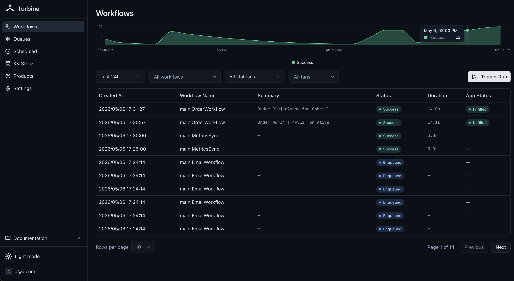

# Workflows




A workflow is a function with the signature `func(ctx turbine.Context, input P) (R, error)`.

```go
myWorkflow := func(ctx turbine.Context, input string) (string, error) {
    doubled, err := turbine.Do(ctx, func(ctx context.Context) (string, error) {
        return input + input, nil
    }, turbine.WithStepName("double"))
    if err != nil {
        return "", err
    }
    return doubled, nil
}

turbine.Register(rt, myWorkflow)
```

## Running a Workflow

```go
handle, err := turbine.Run(rt, myWorkflow, "hello")
if err != nil {
    log.Fatal(err)
}

result, err := handle.GetResult()
// result == "hellohello"
```

## Registration Options

```go
turbine.Register(rt, myWorkflow,
    turbine.WithName("my-workflow"),       // custom name (default: function name)
    turbine.WithMaxRetries(50),            // max recovery attempts (default: 100)
)
```

## Workflow Summary

When you have many instances of the same workflow, the list view just shows repeated names. `WithSummaryFunc` generates a one-line description from the input so you can tell them apart at a glance.

```go
type OrderInput struct {
    OrderID  string `json:"order_id"`
    Customer string `json:"customer"`
}

turbine.Register(rt, OrderWorkflow,
    turbine.WithSummaryFunc(func(in OrderInput) string {
        return fmt.Sprintf("Order %s for %s", in.OrderID, in.Customer)
    }),
)
```

The summary is:
- Computed once when the workflow starts, from the decoded input
- Stored in the database and shown in the dashboard list, detail sidebar, and steps page
- Limited to 200 characters (silently truncated)
- Safe, if the function panics, the workflow still runs with an empty summary

```go
// Access it programmatically
status, _ := handle.GetStatus()
fmt.Println(status.Summary) // "Order ORD-123 for Alice"
```

## Input Schema

When a workflow is registered with `WithDashboardTrigger()`, the dashboard shows a raw JSON textarea for the input. You can provide an input schema to render a typed form instead:

```go
turbine.Register(rt, DeployWorkflow,
    turbine.WithDashboardTrigger(),
    turbine.WithInputSchema(map[string]any{
        "fields": []map[string]any{
            {"name": "service", "type": "string", "label": "Service Name", "required": true, "placeholder": "api-gateway"},
            {"name": "environment", "type": "select", "label": "Environment", "required": true, "options": []string{"staging", "production"}},
            {"name": "regions", "type": "multiselect", "label": "Regions", "options": []string{"us-east-1", "us-west-2", "eu-west-1"}},
            {"name": "version", "type": "string", "label": "Version", "required": true, "placeholder": "v1.2.3"},
            {"name": "dry_run", "type": "boolean", "label": "Dry Run"},
        },
    }),
)
```

### Field Types

| Type | Renders | Value |
|---|---|---|
| `string` | Text input | `string` |
| `number` | Number input | `number` |
| `boolean` | Toggle switch | `bool` |
| `select` | Dropdown | `string` |
| `multiselect` | Multi-select dropdown | `[]string` |
| `textarea` | Multi-line text | `string` |
| `json` | Code editor | any JSON value |

### Field Properties

| Property | Type | Description |
|---|---|---|
| `name` | `string` | Field name in the JSON input (required) |
| `type` | `string` | One of the types above (required) |
| `label` | `string` | Display label (defaults to `name`) |
| `required` | `bool` | Whether the field is required |
| `default` | any | Default value |
| `options` | `[]string` | Options for `select` and `multiselect` types |
| `placeholder` | `string` | Placeholder text |
| `description` | `string` | Help text shown below the field |

::: info
The schema is purely for the dashboard UI, the workflow still receives the same JSON input regardless of whether a schema is provided.
:::

## Run Options

```go
turbine.Run(rt, myWorkflow, input,
    turbine.WithID("custom-id"),                      // deterministic ID
    turbine.WithQueue("my-queue"),                     // enqueue instead of run immediately
    turbine.WithDeduplicationID("dedup-key"),          // prevent duplicate enqueues
    turbine.WithPriority(1),                           // lower = higher priority
    turbine.WithQueuePartitionKey("tenant-1"),         // partition key for partitioned queues
    turbine.WithTimeout(30*time.Second),               // cancel after 30s
    turbine.WithDeadline(time.Now().Add(time.Hour)),   // cancel at specific time
)
```

## Timeout / Deadline

Set a timeout or absolute deadline on a workflow. The workflow's context is cancelled when the time expires. Both values are persisted, on recovery, the original deadline is restored.

```go
// Timeout: relative duration from when the workflow starts executing
handle, _ := turbine.Run(rt, myWorkflow, input,
    turbine.WithTimeout(5*time.Minute),
)

// Deadline: absolute point in time
handle, _ := turbine.Run(rt, myWorkflow, input,
    turbine.WithDeadline(time.Date(2025, 12, 31, 23, 59, 59, 0, time.UTC)),
)
```

::: info
If both are set, the deadline takes precedence.
:::

## Management

```go
// Get the current workflow ID from within a workflow
wfID, err := ctx.WorkflowID()

// Retrieve a handle to an existing workflow
handle := turbine.Retrieve[string](rt, "workflow-id")
result, err := handle.GetResult()
status, err := handle.GetStatus()

// Cancel / Resume
rt.Cancel("workflow-id")
rt.Resume("workflow-id")

// Inspect steps
steps, err := rt.Steps("workflow-id")
```

## Error Handling

`Run` returns a `*Error` with a specific code when something goes wrong:

```go
handle, err := turbine.Run(rt, myWorkflow, input)
if errors.Is(err, turbine.ErrShuttingDown) {
    // runtime is shutting down, not accepting new work
}
if errors.Is(err, &turbine.Error{Code: turbine.ErrConflictingID}) {
    // workflow with this ID already exists
}
```

See [Error Handling](/concepts/errors) for all error codes and patterns.
